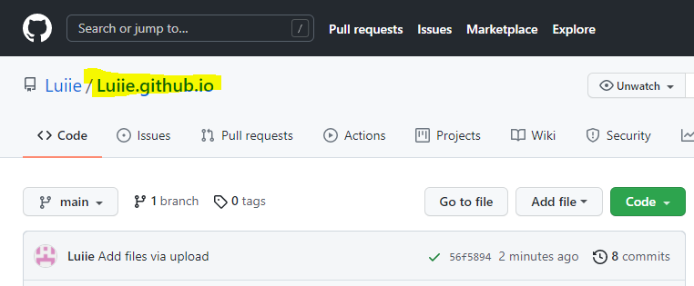
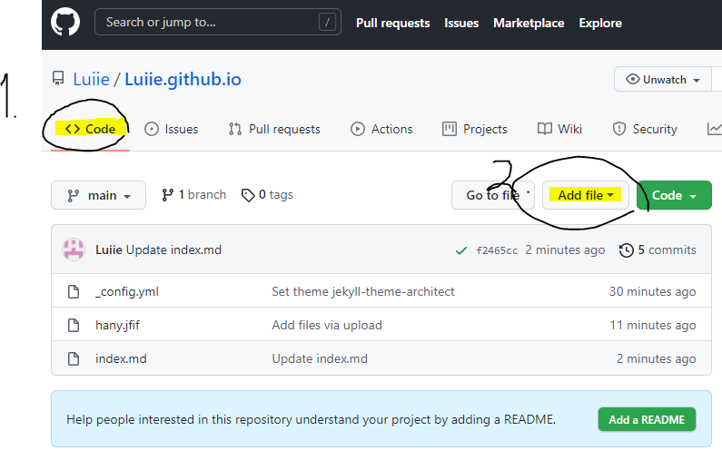
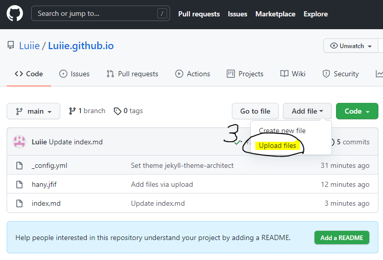
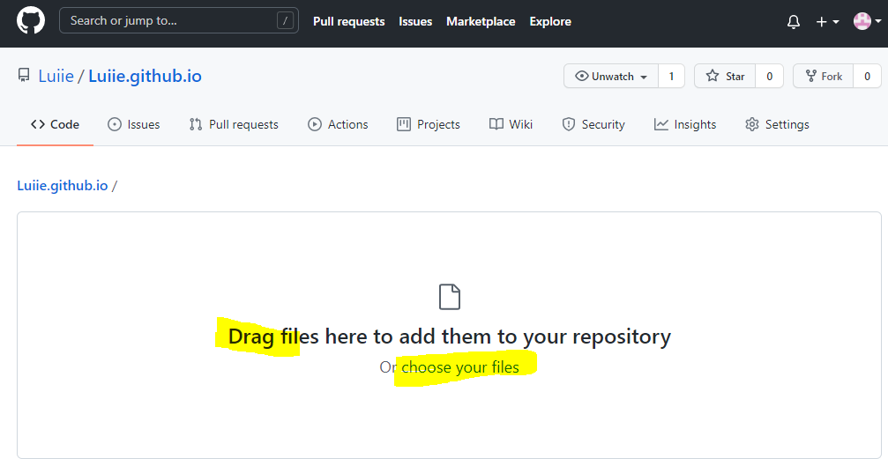
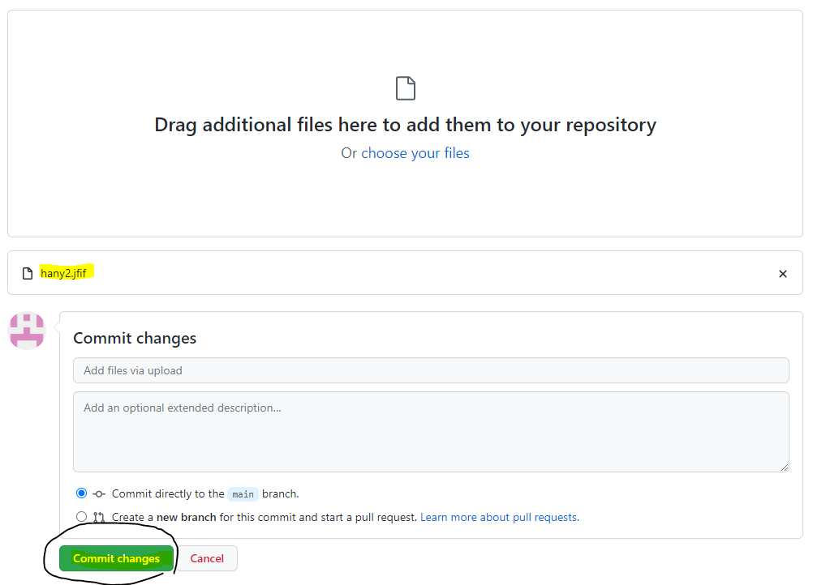
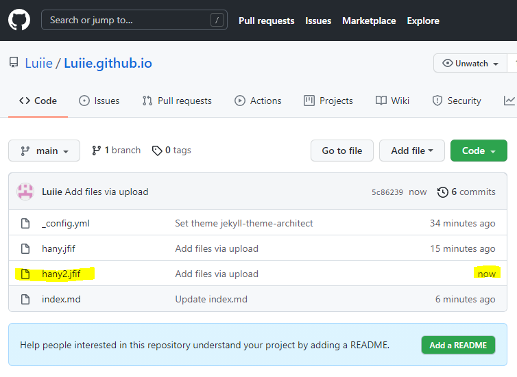
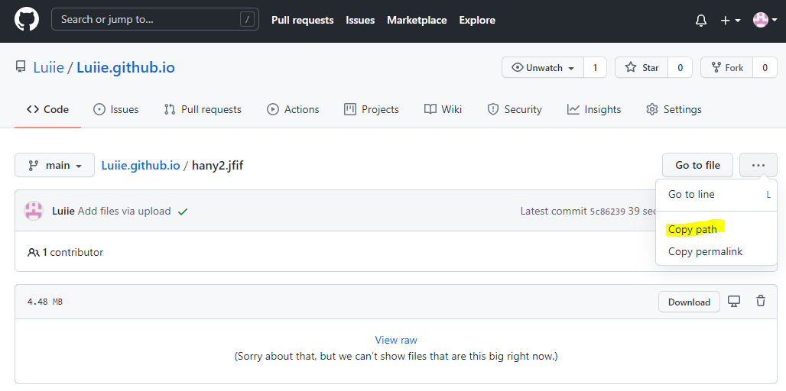
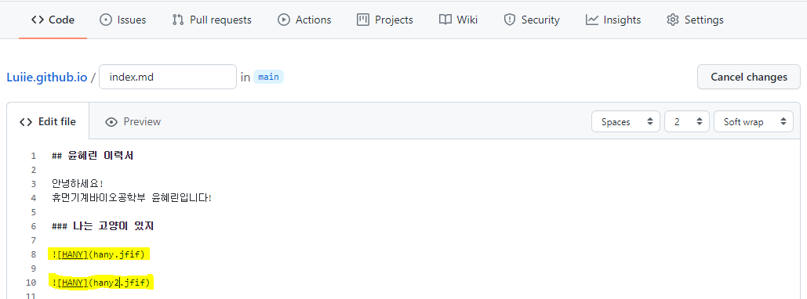
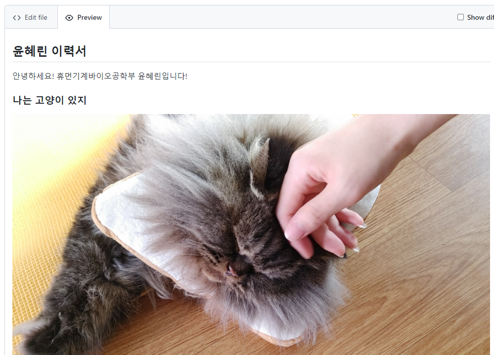

## 윤혜린 이력서

안녕하세요!

휴먼기계바이오공학부 윤혜린입니다!

### 저는 고양이와 살고 있습니다


(하지만 아직 사이즈 조절 방법을 모른다네)

```markdown
#하니 

Female(Neutered)
2017 / 4 / 2 (현재 4살)
하이랜드 스트레이트


```
<br/>
<br/>
<br/>

------------------------------------------------------------

# 첫번째 과제 수행하는 법

어떻게 이미지를 넣을 수 있는지 알아봅시다!

구글링 열심히 했습니다(하고 있습니다!)....

## 1


노랑색 형광펜을 따라와주세요! 그냥 클릭하시면 됩니다!

## 2

## 3

## 4

## 5

## 6

## 7


copy path를 누르셨다면 Ctrl + V 로 붙여넣을 수 있게 됩니다.

## 8

작성 중인 레쥬메 페이지로 이동해 코드를 수정하는 화면으로 이동합니다




형식은  입니다!

## 9

작성중이던 Edit file에서 Preview로 이동하시면 사진이 들어간 것을 알 수 있습니다.


쨘

맨 하단의 Commit change(녹색버튼)을 눌러 저장합니다.


